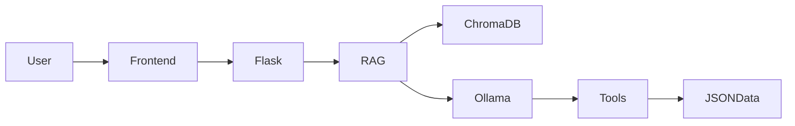

<div align="center">

# ⚡ KRONIQ
### AI Business Memory OS


**Turn business operations into searchable AI memory.**

</div>

---

## 🚀 Features

- 🧠 AI-Powered Business Memory (RAG)
- 🔍 Semantic Search with ChromaDB
- 📦 Inventory Management
- 📋 Task & Project Tracking
- ⚡ Real-Time AI Chat Streaming
- 🤖 Tool Calling (AI can update real data)

---

## 🏗 Architecture



---

## 🛠 Tech Stack

- Python + Flask
- ChromaDB
- Ollama (Qwen2.5)
- Sentence Transformers
- Vanilla JavaScript
- JSON Storage

---

## 📂 Structure

```bash
├── app.py
├── rag.py
├── templates/
│   └── index.html
├── data/
│   ├── activities.json
│   ├── tasks.json
│   ├── inventory.json
│   └── projects.json
└── chroma_db/
```

---

## ⚡ Quick Start

```bash
pip install -r requirements.txt

ollama serve
ollama pull qwen2.5

python app.py
```

Open:

```text
http://localhost:8080
```

---

## 🤖 Example

**You:**  
> Add 12 more Hikvision cameras to stock

**Kroniq:**  
✔ Updates inventory automatically using AI Tool Calling.

---

<div align="center">

### Built for modern service businesses

**AI • RAG • Inventory • Tasks • Memory**

</div>
